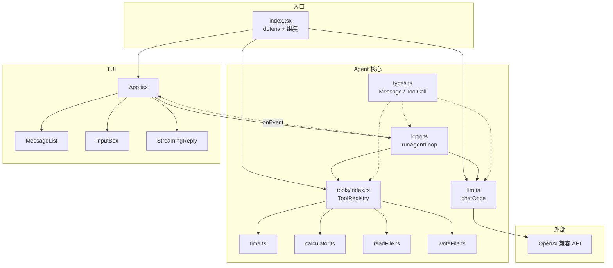

# miniAgent 架构说明

本文面向学习：说明各模块职责、Agent Loop 原理、关键概念对照，以及运行时数据流。

## 1. 设计原则

1. **状态 = messages**：Agent 的记忆就是一条不断增长的消息数组。
2. **手写 loop，不藏魔法**：工具调用、写回、再请求，全部在 `loop.ts` 可见。
3. **UI 与推理分离**：TUI 只通过事件回调展示；真正协议消息在 `historyRef`。
4. **工具可插拔**：`ToolRegistry` 统一「说明书（给模型）」与「执行体（给本地）」。

## 2. 模块职责

| 模块 | 路径 | 职责 |
|------|------|------|
| 入口 | `src/index.tsx` | 加载 `.env`、创建客户端与工具、`render(<App />)` |
| 类型 | `src/agent/types.ts` | `Message` / `ToolCall` / `AgentEvent` 等 |
| LLM 客户端 | `src/agent/llm.ts` | 一次 Chat Completions 调用（流式 / 非流式）+ 分片拼接 + 响应规范化 |
| Agent Loop | `src/agent/loop.ts` | 多轮：调模型 → 执行工具 → 写回 → 再调 |
| 工具注册表 | `src/agent/tools/index.ts` | 注册 / 查找 / 列出工具 |
| 具体工具 | `time.ts` / `calculator.ts` / `readFile.ts` / `writeFile.ts` | 可调用能力实现 |
| TUI | `src/tui/App.tsx` 等 | 输入、对话流、工具状态展示；`StreamingReply` 逐字渲染当前回复 |

## 3. Agent Loop 伪代码

```
function runAgentLoop(messages, tools):
  for iteration in 1..maxIterations:
    response = chatOnce(messages, tools)   # 调 LLM 一次
    messages.append(response.assistantMessage)

    if response.stopReason == "stop":
      return response.content               # 最终文本，结束

    if response.stopReason == "tool_calls":
      for call in response.tool_calls:
        result = tools.execute(call.name, parseJson(call.arguments))
        messages.append({
          role: "tool",
          tool_call_id: call.id,
          content: result
        })
      continue                              # 带着工具结果再问 LLM

  return "达到最大迭代次数"
```

对应实现：`src/agent/loop.ts` 中的 `runAgentLoop`。

## 4. 关键概念对照表

| 概念 | 在本项目中的位置 | 含义 |
|------|------------------|------|
| `messages` | `Message[]`，Agent 历史 | 发给模型的完整上下文；包含 system/user/assistant/tool |
| `tool_calls` | `assistant` 消息上的字段 | 模型声明「请执行这些函数」；含 `id` / `name` / `arguments` |
| `role: "tool"` | tool 结果消息 | 本地执行结果写回；必须带 `tool_call_id` 对齐某次 call |
| `finish_reason` / stop reason | `LlmResponse.stopReason` | `stop`=最终文本；`tool_calls`=还需跑工具；`length`=截断 |
| `tools`（API 参数） | `toApiTools(registry.list())` | 给模型看的工具 JSON Schema 列表 |
| `tool_choice` | `llm.ts` 里设为 `auto` | 让模型自己决定是否调用工具 |
| `stream: true` / SSE | `chatStream` | 响应以多条 `data: {chunk}` 推送，以 `data: [DONE]` 结束 |
| `delta` | `chunk.choices[0].delta` | 每个 chunk 只带「增量」：一段 `content` 或若干 `tool_calls` 碎片 |
| `tool_calls[].index` | `chatStream` 中的槽位 Map | 标明碎片属于第几个工具调用；按它归并 `id` / `name` / `arguments` |

### 四种 role 速记

```
system     → 人设 / 规则（通常第一条）
user       → 人类输入
assistant  → 模型输出（纯文本，或附带 tool_calls）
tool       → 某个 tool_call 的执行结果（不是模型说的话）
```

## 5. Mermaid：组件 / 模块关系



## 6. Mermaid：运行时数据流

```mermaid
sequenceDiagram
  actor User as 用户
  participant TUI as App / TUI
  participant Loop as runAgentLoop
  participant LLM as chatOnce
  participant API as OpenAI 兼容端点
  participant Tools as ToolRegistry

  User->>TUI: 输入问题并回车
  TUI->>TUI: UI 追加 user 行
  TUI->>Loop: messages.push(user) 后调用 loop
  Loop->>LLM: messages + tools 定义
  LLM->>API: POST /chat/completions
  API-->>LLM: assistant (+ 可选 tool_calls)
  LLM-->>Loop: LlmResponse

  alt stopReason == tool_calls
    Loop->>TUI: onEvent(tool_start)
    Loop->>Tools: execute(name, args)
    Tools-->>Loop: result 字符串
    Loop->>TUI: onEvent(tool_end)
    Loop->>Loop: messages.push(role=tool)
    Loop->>LLM: 再次请求（含工具结果）
    LLM->>API: POST /chat/completions
    API-->>LLM: 最终 assistant 文本
    LLM-->>Loop: stopReason=stop
  end

  Loop->>TUI: onEvent(done, finalText)
  TUI->>User: 渲染 Agent 最终回复
```

## 6.1 流式输出（stream: true）

### 为什么要流式

非流式时，模型生成完整回答（可能十几秒）后才一次性返回，终端一直空白。
流式时，服务端用 **SSE（Server-Sent Events）** 边生成边推送，TUI 可以逐字显示。

### 线上的数据长什么样

```
data: {"choices":[{"delta":{"role":"assistant","content":"我先"}}]}
data: {"choices":[{"delta":{"content":"算一下。"}}]}
data: {"choices":[{"delta":{"tool_calls":[{"index":0,"id":"call_a","function":{"name":"calculator","arguments":""}}]}}]}
data: {"choices":[{"delta":{"tool_calls":[{"index":0,"function":{"arguments":"{\"expre"}}]}}]}
data: {"choices":[{"delta":{"tool_calls":[{"index":0,"function":{"arguments":"ssion\":\"1+2\"}"}}]}}]}
data: {"choices":[{"delta":{},"finish_reason":"tool_calls"}]}
data: [DONE]
```

### 拼接规则（`chatStream`）

| 字段 | 规则 | 原因 |
|------|------|------|
| `delta.content` | 按到达顺序追加 | 文本就是被切开的字符串 |
| `tool_calls[i].index` | 作为槽位键 | 多个工具调用的碎片可能交错到达 |
| `id` | 首次出现时赋值（不追加） | 通常只在第一个碎片里出现 |
| `function.name` | 空则赋值；相同则忽略；否则追加 | 兼容「只发一次 / 重复发送 / 切碎发送」三种端点行为 |
| `function.arguments` | 一律追加 | JSON 字符串被任意切开；**流结束前不是合法 JSON，不能执行** |
| `finish_reason` | 记录最后一个非空值 | 一般只在最后一个有效 chunk 上出现 |
| `choices: []` | 跳过 | 部分端点末尾会推一个只带 usage 的 chunk |

流读完后，槽位按 `index` 排序，组装成与非流式**完全同构**的 `assistant` 消息，
所以 `loop.ts` 的工具循环一行都不用改——流式只是「等待期间多了实时回调」。

### 事件对照（loop → TUI）

| 事件 | 含义 | TUI 行为 |
|------|------|----------|
| `text_delta` | 一段文本增量（≈ onTextDelta） | 追加到 `StreamingReply` 草稿区 |
| `tool_call_start` | 模型开始生成某个工具调用（≈ onToolCallStart） | 打一行状态提示 |
| `tool_call_delta` | 工具参数生成进度 | 草稿区下方显示「生成 write_file 参数中… N 字符」 |
| `llm_turn_end` | 本次 LLM 调用结束 | 收起草稿区；中间轮次的说明文字归档 |
| `tool_start` / `tool_end` | 本地执行工具 / 拿到结果（≈ onToolResult） | 黄色 / 紫色工具行 |
| `done` | 整个 loop 结束 | 最终回复归档到消息列表 |

### 开关

`OPENAI_STREAM=false` 时 `chatOnce` 走 `chatNonStream`，不会产生 `text_delta`，
其余事件（`llm_turn_end` / `tool_*` / `done`）照常，UI 行为一致，只是没有逐字效果。

### Mermaid：流式时序

```mermaid
sequenceDiagram
  actor User as 用户
  participant TUI as App / StreamingReply
  participant Loop as runAgentLoop
  participant LLM as chatStream
  participant API as OpenAI 兼容端点（SSE）
  participant Tools as ToolRegistry

  User->>TUI: 输入问题并回车
  TUI->>Loop: messages.push(user)；runAgentLoop()
  Loop->>LLM: chatOnce(messages, tools, hooks)
  LLM->>API: POST /chat/completions (stream: true)

  loop 每个 SSE chunk
    API-->>LLM: data: {delta}
    alt delta.content
      LLM-->>Loop: hooks.onTextDelta(text)
      Loop-->>TUI: text_delta
      TUI->>TUI: 草稿区追加文字（逐字渲染）
    else delta.tool_calls[index]
      LLM->>LLM: 按 index 拼接 id / name / arguments
      LLM-->>Loop: onToolCallStart / onToolCallDelta
      Loop-->>TUI: tool_call_start / tool_call_delta
    end
  end

  API-->>LLM: finish_reason + data: [DONE]
  LLM-->>Loop: 完整 assistant 消息（与非流式同构）
  Loop-->>TUI: llm_turn_end（收起草稿区）

  alt 有 tool_calls
    Loop->>Tools: execute(name, JSON.parse(arguments))
    Tools-->>Loop: result
    Loop-->>TUI: tool_start / tool_end
    Loop->>Loop: messages.push(role=tool)
    Loop->>LLM: 下一轮 chatStream（重复上面的流程）
  else 最终文本
    Loop-->>TUI: done(finalText)
    TUI->>User: 归档为一条 Agent 消息
  end
```

## 7. 一次典型对话在 messages 里长什么样

用户问：「现在几点？算一下 1+2」

```
[
  { role: "system", content: "你是……可用工具：…" },
  { role: "user", content: "现在几点？算一下 1+2" },
  {
    role: "assistant",
    content: null,
    tool_calls: [
      { id: "call_1", function: { name: "get_current_time", arguments: "{}" } },
      { id: "call_2", function: { name: "calculator", arguments: "{\"expression\":\"1+2\"}" } }
    ]
  },
  { role: "tool", tool_call_id: "call_1", content: "{\"local\":\"…\"}" },
  { role: "tool", tool_call_id: "call_2", content: "{\"value\":3}" },
  { role: "assistant", content: "现在是……；1+2=3。" }
]
```

注意：中间那条带 `tool_calls` 的 assistant，以及随后的 `role=tool`，对用户来说是「幕后」；TUI 用事件把它们可视化成黄色/紫色状态行。

## 8. 安全相关

| 点 | 做法 |
|----|------|
| `read_file` | `path.resolve` + `path.relative` 检查，禁止 `..` 越出项目根；禁止绝对路径 |
| `write_file` | 同样限制在项目根内；拒绝 `.env*`、`node_modules`、`.git`、密钥/证书类文件；自动创建父目录；标明 created/overwritten |
| `calculator` | 手写递归下降解析，字符白名单；不用 `eval` / `Function` |
| 密钥 | 只放 `.env`，`gitignore` 忽略；仓库仅保留 `.env.example`；工具层也禁止写 `.env` |

## 8.1 `write_file` 参数与行为

| 参数 | 类型 | 必填 | 含义 |
|------|------|------|------|
| `path` | string | 是 | 相对项目根的目标路径 |
| `content` | string | 是 | 完整文件文本（UTF-8） |

成功时返回 JSON：`{ path, bytes, overwritten, created }`。失败时返回以「写入失败：」开头的字符串（仍作为 `role=tool` 内容写回，不中断 loop）。

## 9. 扩展练习（可选）

1. 新增工具 `list_dir`：同样限制在项目根内。
2. 用 ink 的 `<Static>` 渲染已归档消息，长对话流式刷新时减少整屏重绘闪烁。
3. 把 `maxIterations` 做成 `.env` 配置。
4. 将 tool 结果做摘要后再写回，观察对长文件场景的影响。
